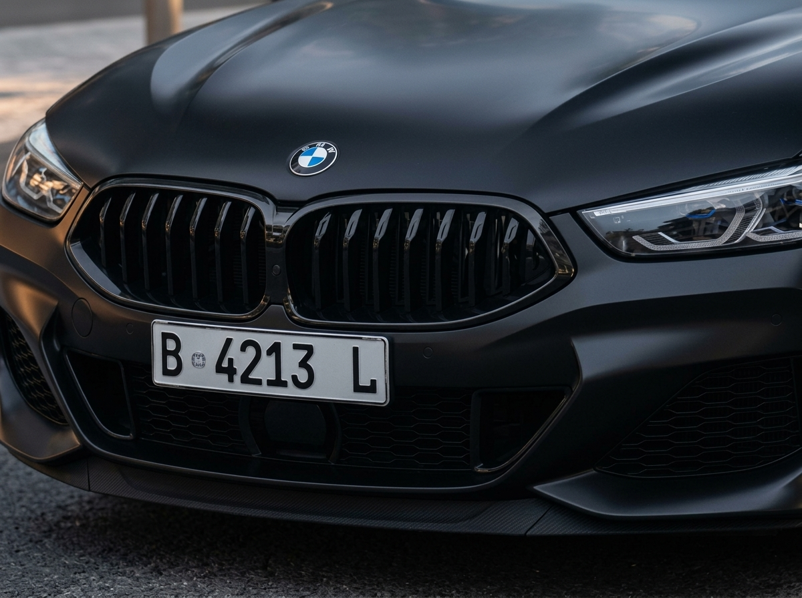

# License Plate OCR with SmolVLM

A modern take on text recognition: instead of a classic CRNN + CTC pipeline, this uses a vision-language model (VLM) — `HuggingFaceTB/SmolVLM-Instruct` — prompted in natural language to extract text from an image and return it as structured JSON.

## Overview

Text recognition doesn't always require training a dedicated model. A general-purpose VLM can be prompted directly to read text out of an image, with the extraction format controlled entirely through the prompt (here: plain text only, no extra characters, returned as JSON).

This repo demonstrates that approach on a license plate image:

1. Load an image
2. Build a chat-style prompt instructing the model to act as a license plate extractor and return JSON
3. Run the prompt + image through the VLM
4. Decode the generated text

## Model

`HuggingFaceTB/SmolVLM-Instruct` — a compact vision-language model, loaded via `transformers` (`AutoProcessor` + `AutoModelForImageTextToText`), run in `bfloat16` on GPU when available.

## Result (verified — actual Colab run)

Input: a close-up photo of a car's front license plate, uploaded manually and displayed inline in the notebook for reference.



Prompt (excerpt): *"You are an expert license plate extractor agent. Extract this text with only the text, no additional characters... Return it in JSON format."*

Raw model output (only the newly generated tokens, prompt not echoed):
```json
{
    "text": "B 4213 L"
}
```

This is then parsed with `json.loads()` rather than just printed as-is — the notebook reports clearly if parsing fails instead of assuming the output is always valid JSON. In this run, parsing succeeded and the extracted plate text matched the plate visible in the source image exactly.

> **Note on scope:** this is a single qualitative example, not a benchmark. A VLM's OCR reliability varies with image angle, lighting, plate style, and font — no accuracy/error-rate metric across multiple samples was measured here.

## Setup notes

- **HF_TOKEN (optional):** the notebook first checks Colab Secrets for `HF_TOKEN`; if not set, it prompts for manual input. A token isn't required for this public model but raises your Hugging Face API rate limit.
- **Image input:** the notebook uses Colab's file upload widget (`google.colab.files.upload()`) rather than fetching an image from a URL — some external hosts throttle or block requests from datacenter IPs (as seen when this notebook first tried loading a demo image directly from a website), so a local upload is the more reliable path.

## How to run

1. Open `notebooks/license_plate_ocr_smolvlm.ipynb` in Google Colab
2. Set the runtime to GPU (recommended; CPU works but is slower)
3. Run all cells — when prompted, upload a license plate image

## Repo structure

```
.
├── notebooks/
│   └── license_plate_ocr_smolvlm.ipynb
├── images/
│   └── plat-mobil.jpeg
├── LICENSE
├── README.md
└── README.id.md
```

## License

MIT — see [LICENSE](LICENSE).
